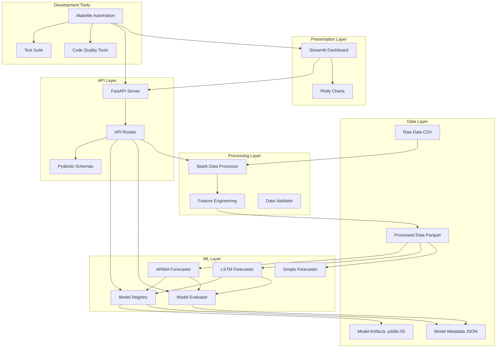
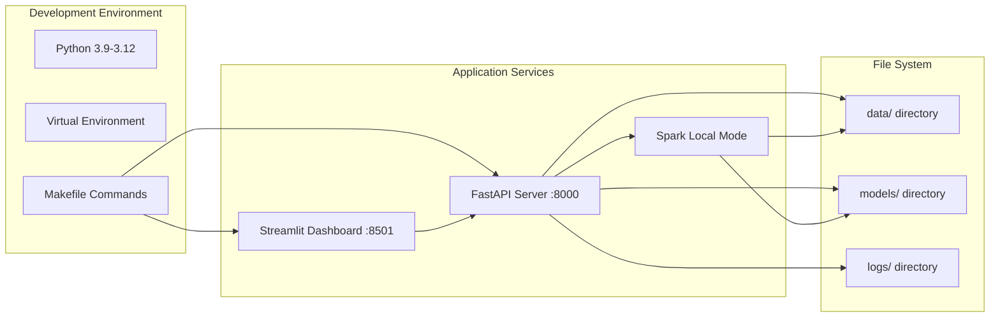

# Design Document: AirSense Completion and Modernization

## Overview

This design document specifies the technical architecture and implementation approach for completing and modernizing the AirSense enterprise air quality monitoring system. The modernization addresses critical gaps in the codebase including missing components (Model Registry, Model Evaluator), deprecated code patterns (pandas methods, Pydantic v1), import errors, and Docker removal.

### Goals

1. **Remove Docker Infrastructure**: Clean removal of Docker files and documentation to simplify deployment to native Python execution
2. **Complete Missing Components**: Implement Model Registry and Model Evaluator systems for ML lifecycle management
3. **Modernize Code**: Update deprecated pandas methods, migrate to Pydantic v2, fix import errors
4. **Improve Developer Experience**: Create comprehensive Makefile for development automation
5. **Ensure Production Readiness**: Add comprehensive testing, error handling, and documentation

### Non-Goals

- Adding new ML models or algorithms beyond ARIMA and LSTM
- Implementing distributed deployment or Kubernetes orchestration
- Adding authentication or authorization systems
- Implementing real-time streaming data ingestion
- Creating mobile or desktop applications

### Success Metrics

- Zero import errors or deprecation warnings when running on Python 3.9-3.12
- All tests pass with ≥80% code coverage
- Model Registry can manage 100+ model versions without performance degradation
- Model Evaluator can evaluate models on 10,000 data points in <1 second
- Complete documentation enabling new developers to set up and run the system in <30 minutes

## Architecture

### High-Level Architecture



### Deployment Architecture (Post-Docker Removal)



### Technology Stack

| Layer | Technology | Version | Purpose |
|-------|-----------|---------|---------|
| **Data Processing** | Apache Spark | 3.4+ | Distributed data processing and ETL |
| **Data Analysis** | pandas | 2.0+ | Data manipulation and analysis |
| **ML Framework** | scikit-learn | 1.3+ | Traditional ML algorithms |
| **Time Series** | statsmodels | 0.14+ | ARIMA and statistical models |
| **Deep Learning** | TensorFlow | 2.13+ | LSTM neural networks |
| **API Framework** | FastAPI | 0.104+ | REST API server |
| **Web Server** | Uvicorn | 0.24+ | ASGI server |
| **Dashboard** | Streamlit | 1.28+ | Interactive web interface |
| **Validation** | Pydantic | 2.4+ | Data validation and settings |
| **Logging** | structlog | Latest | Structured logging |
| **Testing** | pytest | Latest | Unit and integration testing |
| **Code Quality** | ruff/flake8 | Latest | Linting and formatting |
| **Type Checking** | mypy | Latest | Static type checking |

## Components and Interfaces

### 1. Model Registry System

#### Purpose
Manage ML model lifecycle including versioning, metadata tracking, storage, and retrieval.

#### Class Design

```python
from typing import Dict, List, Optional, Any
from pathlib import Path
from datetime import datetime
import json
import joblib
from dataclasses import dataclass, asdict

@dataclass
class ModelMetadata:
    """Metadata for a registered model."""
    model_id: str
    model_name: str
    model_type: str  # "arima", "lstm", "xgboost", etc.
    version: str
    file_path: str
    training_date: datetime
    parameters: Dict[str, Any]
    metrics: Dict[str, float]
    tags: List[str]
    target_pollutant: Optional[str]
    training_data_source: Optional[str]
    feature_set: Optional[List[str]]
    created_at: datetime
    updated_at: datetime
    
    def to_dict(self) -> Dict[str, Any]:
        """Convert to dictionary for JSON serialization."""
        data = asdict(self)
        data['training_date'] = self.training_date.isoformat()
        data['created_at'] = self.created_at.isoformat()
        data['updated_at'] = self.updated_at.isoformat()
        return data
    
    @classmethod
    def from_dict(cls, data: Dict[str, Any]) -> 'ModelMetadata':
        """Create from dictionary."""
        data['training_date'] = datetime.fromisoformat(data['training_date'])
        data['created_at'] = datetime.fromisoformat(data['created_at'])
        data['updated_at'] = datetime.fromisoformat(data['updated_at'])
        return cls(**data)


class ModelRegistry:
    """
    File-based model registry for managing ML model lifecycle.
    
    Directory structure:
        models/
            registry.json          # Master registry index
            {model_id}/
                model.joblib       # Model artifact
                metadata.json      # Model metadata
    """
    
    def __init__(self, registry_dir: str = "models"):
        self.registry_dir = Path(registry_dir)
        self.registry_file = self.registry_dir / "registry.json"
        self.logger = get_logger(__name__)
        
        # Create directory structure
        self.registry_dir.mkdir(parents=True, exist_ok=True)
        
        # Load or initialize registry
        self._registry: Dict[str, ModelMetadata] = {}
        self._load_registry()
    
    def register_model(
        self,
        model: Any,
        model_name: str,
        model_type: str,
        parameters: Dict[str, Any],
        metrics: Dict[str, float],
        tags: Optional[List[str]] = None,
        target_pollutant: Optional[str] = None,
        training_data_source: Optional[str] = None,
        feature_set: Optional[List[str]] = None
    ) -> str:
        """
        Register a new model with metadata.
        
        Args:
            model: The trained model object
            model_name: Human-readable model name
            model_type: Type of model (arima, lstm, etc.)
            parameters: Training parameters
            metrics: Performance metrics
            tags: Optional tags for categorization
            target_pollutant: Target pollutant for forecasting
            training_data_source: Source of training data
            feature_set: List of features used
            
        Returns:
            model_id: Unique identifier for the registered model
        """
        # Generate unique model ID
        model_id = self._generate_model_id(model_name, model_type)
        version = self._generate_version(model_name)
        
        # Create model directory
        model_dir = self.registry_dir / model_id
        model_dir.mkdir(parents=True, exist_ok=True)
        
        # Save model artifact
        model_path = model_dir / "model.joblib"
        joblib.dump(model, model_path)
        
        # Create metadata
        metadata = ModelMetadata(
            model_id=model_id,
            model_name=model_name,
            model_type=model_type,
            version=version,
            file_path=str(model_path),
            training_date=datetime.now(),
            parameters=parameters,
            metrics=metrics,
            tags=tags or [],
            target_pollutant=target_pollutant,
            training_data_source=training_data_source,
            feature_set=feature_set,
            created_at=datetime.now(),
            updated_at=datetime.now()
        )
        
        # Save metadata
        metadata_path = model_dir / "metadata.json"
        with open(metadata_path, 'w') as f:
            json.dump(metadata.to_dict(), f, indent=2)
        
        # Update registry
        self._registry[model_id] = metadata
        self._save_registry()
        
        self.logger.info(f"Model registered: {model_id}", 
                        model_name=model_name, version=version)
        
        return model_id
    
    def get_model(self, model_id: str) -> Tuple[Any, ModelMetadata]:
        """
        Retrieve a model and its metadata.
        
        Args:
            model_id: Unique model identifier
            
        Returns:
            Tuple of (model_object, metadata)
        """
        if model_id not in self._registry:
            raise ValueError(f"Model {model_id} not found in registry")
        
        metadata = self._registry[model_id]
        
        # Validate file exists
        if not Path(metadata.file_path).exists():
            raise FileNotFoundError(
                f"Model file not found: {metadata.file_path}"
            )
        
        # Load model
        model = joblib.load(metadata.file_path)
        
        self.logger.info(f"Model loaded: {model_id}")
        return model, metadata
    
    def list_models(
        self,
        model_type: Optional[str] = None,
        tags: Optional[List[str]] = None,
        target_pollutant: Optional[str] = None
    ) -> List[ModelMetadata]:
        """
        List all registered models with optional filtering.
        
        Args:
            model_type: Filter by model type
            tags: Filter by tags (any match)
            target_pollutant: Filter by target pollutant
            
        Returns:
            List of model metadata
        """
        models = list(self._registry.values())
        
        # Apply filters
        if model_type:
            models = [m for m in models if m.model_type == model_type]
        
        if tags:
            models = [m for m in models 
                     if any(tag in m.tags for tag in tags)]
        
        if target_pollutant:
            models = [m for m in models 
                     if m.target_pollutant == target_pollutant]
        
        # Sort by creation date (newest first)
        models.sort(key=lambda m: m.created_at, reverse=True)
        
        return models
    
    def delete_model(self, model_id: str) -> None:
        """
        Delete a model and its metadata.
        
        Args:
            model_id: Unique model identifier
        """
        if model_id not in self._registry:
            raise ValueError(f"Model {model_id} not found in registry")
        
        metadata = self._registry[model_id]
        
        # Delete model directory
        model_dir = Path(metadata.file_path).parent
        if model_dir.exists():
            import shutil
            shutil.rmtree(model_dir)
        
        # Remove from registry
        del self._registry[model_id]
        self._save_registry()
        
        self.logger.info(f"Model deleted: {model_id}")
    
    def update_tags(self, model_id: str, tags: List[str]) -> None:
        """Update tags for a model."""
        if model_id not in self._registry:
            raise ValueError(f"Model {model_id} not found in registry")
        
        self._registry[model_id].tags = tags
        self._registry[model_id].updated_at = datetime.now()
        
        # Update metadata file
        metadata_path = Path(self._registry[model_id].file_path).parent / "metadata.json"
        with open(metadata_path, 'w') as f:
            json.dump(self._registry[model_id].to_dict(), f, indent=2)
        
        self._save_registry()
        self.logger.info(f"Tags updated for model: {model_id}")
    
    def get_latest_version(self, model_name: str) -> Optional[ModelMetadata]:
        """Get the latest version of a model by name."""
        models = [m for m in self._registry.values() 
                 if m.model_name == model_name]
        
        if not models:
            return None
        
        # Sort by version (assuming semantic versioning)
        models.sort(key=lambda m: m.version, reverse=True)
        return models[0]
    
    def _generate_model_id(self, model_name: str, model_type: str) -> str:
        """Generate unique model ID."""
        timestamp = datetime.now().strftime("%Y%m%d_%H%M%S")
        return f"{model_type}_{model_name}_{timestamp}"
    
    def _generate_version(self, model_name: str) -> str:
        """Generate version number for model."""
        existing_models = [m for m in self._registry.values() 
                          if m.model_name == model_name]
        
        if not existing_models:
            return "1.0.0"
        
        # Get latest version and increment
        versions = [m.version for m in existing_models]
        versions.sort(reverse=True)
        latest = versions[0]
        
        # Simple increment (major.minor.patch)
        parts = latest.split('.')
        patch = int(parts[2]) + 1
        return f"{parts[0]}.{parts[1]}.{patch}"
    
    def _load_registry(self) -> None:
        """Load registry from disk."""
        if not self.registry_file.exists():
            self._registry = {}
            return
        
        try:
            with open(self.registry_file, 'r') as f:
                data = json.load(f)
            
            self._registry = {
                model_id: ModelMetadata.from_dict(metadata)
                for model_id, metadata in data.items()
            }
            
            self.logger.info(f"Registry loaded: {len(self._registry)} models")
            
        except Exception as e:
            self.logger.error(f"Failed to load registry: {e}")
            self._registry = {}
    
    def _save_registry(self) -> None:
        """Save registry to disk."""
        try:
            data = {
                model_id: metadata.to_dict()
                for model_id, metadata in self._registry.items()
            }
            
            with open(self.registry_file, 'w') as f:
                json.dump(data, f, indent=2)
            
            self.logger.debug("Registry saved")
            
        except Exception as e:
            self.logger.error(f"Failed to save registry: {e}")
            raise
```

#### API Interface

```python
# Integration with existing TimeSeriesForecaster
class TimeSeriesForecaster:
    def __init__(self, registry_dir: str = "models"):
        self.settings = get_settings()
        self.logger = get_logger(__name__)
        self.models = {}
        self.registry = ModelRegistry(registry_dir)
    
    def train_model(self, model_type: str, data: pd.Series, **kwargs) -> Dict[str, Any]:
        """Train a model and register it."""
        # ... existing training logic ...
        
        # Register the trained model
        model_id = self.registry.register_model(
            model=model,
            model_name=f"{model_type}_{target_pollutant}",
            model_type=model_type,
            parameters=train_params,
            metrics=evaluation_metrics,
            tags=["production"] if is_production else ["experimental"],
            target_pollutant=target_pollutant,
            training_data_source=data_source,
            feature_set=feature_columns
        )
        
        return {
            "model_id": model_id,
            "model_type": model_type,
            "metadata": metadata
        }
    
    def load_model_from_registry(self, model_id: str) -> None:
        """Load a model from the registry."""
        model, metadata = self.registry.get_model(model_id)
        self.models[model_id] = model
        self.logger.info(f"Model loaded from registry: {model_id}")
```

### 2. Model Evaluator System

#### Purpose
Comprehensive model evaluation framework for calculating performance metrics and comparing models.

#### Class Design

```python
from typing import Dict, List, Optional, Any, Callable
import numpy as np
import pandas as pd
from sklearn.metrics import (
    mean_absolute_error,
    mean_squared_error,
    r2_score,
    mean_absolute_percentage_error
)
from dataclasses import dataclass
import json

@dataclass
class EvaluationResult:
    """Results from model evaluation."""
    model_id: str
    model_name: str
    model_type: str
    metrics: Dict[str, float]
    test_size: int
    evaluation_date: datetime
    additional_info: Optional[Dict[str, Any]] = None
    
    def to_dict(self) -> Dict[str, Any]:
        """Convert to dictionary."""
        return {
            "model_id": self.model_id,
            "model_name": self.model_name,
            "model_type": self.model_type,
            "metrics": self.metrics,
            "test_size": self.test_size,
            "evaluation_date": self.evaluation_date.isoformat(),
            "additional_info": self.additional_info
        }


class ModelEvaluator:
    """
    Comprehensive model evaluation framework.
    
    Supports:
    - Standard regression metrics (MAE, RMSE, R², MAPE)
    - Custom metric functions
    - Model comparison
    - Evaluation report generation
    """
    
    def __init__(self):
        self.logger = get_logger(__name__)
        self.custom_metrics: Dict[str, Callable] = {}
    
    def evaluate(
        self,
        y_true: np.ndarray,
        y_pred: np.ndarray,
        model_id: Optional[str] = None,
        model_name: Optional[str] = None,
        model_type: Optional[str] = None,
        additional_metrics: Optional[List[str]] = None
    ) -> EvaluationResult:
        """
        Evaluate model predictions against ground truth.
        
        Args:
            y_true: Ground truth values
            y_pred: Model predictions
            model_id: Model identifier
            model_name: Model name
            model_type: Model type
            additional_metrics: List of additional metric names to compute
            
        Returns:
            EvaluationResult object
        """
        # Validate inputs
        self._validate_inputs(y_true, y_pred)
        
        # Calculate standard metrics
        metrics = self._calculate_standard_metrics(y_true, y_pred)
        
        # Calculate additional metrics
        if additional_metrics:
            for metric_name in additional_metrics:
                if metric_name in self.custom_metrics:
                    metrics[metric_name] = self.custom_metrics[metric_name](
                        y_true, y_pred
                    )
        
        # Create result
        result = EvaluationResult(
            model_id=model_id or "unknown",
            model_name=model_name or "unknown",
            model_type=model_type or "unknown",
            metrics=metrics,
            test_size=len(y_true),
            evaluation_date=datetime.now()
        )
        
        self.logger.info(
            f"Model evaluated: {model_name}",
            metrics=metrics
        )
        
        return result
    
    def _validate_inputs(
        self,
        y_true: np.ndarray,
        y_pred: np.ndarray
    ) -> None:
        """Validate input arrays."""
        # Convert to numpy arrays if needed
        if isinstance(y_true, (list, pd.Series)):
            y_true = np.array(y_true)
        if isinstance(y_pred, (list, pd.Series)):
            y_pred = np.array(y_pred)
        
        # Check dimensions
        if y_true.shape != y_pred.shape:
            raise ValueError(
                f"Shape mismatch: y_true {y_true.shape} vs y_pred {y_pred.shape}"
            )
        
        # Check for NaN values
        if np.isnan(y_true).any():
            raise ValueError("y_true contains NaN values")
        if np.isnan(y_pred).any():
            raise ValueError("y_pred contains NaN values")
        
        # Check for infinite values
        if np.isinf(y_true).any():
            raise ValueError("y_true contains infinite values")
        if np.isinf(y_pred).any():
            raise ValueError("y_pred contains infinite values")
    
    def _calculate_standard_metrics(
        self,
        y_true: np.ndarray,
        y_pred: np.ndarray
    ) -> Dict[str, float]:
        """Calculate standard regression metrics."""
        metrics = {}
        
        # Mean Absolute Error
        metrics['mae'] = float(mean_absolute_error(y_true, y_pred))
        
        # Mean Squared Error
        mse = mean_squared_error(y_true, y_pred)
        metrics['mse'] = float(mse)
        
        # Root Mean Squared Error
        metrics['rmse'] = float(np.sqrt(mse))
        
        # R-squared
        metrics['r2'] = float(r2_score(y_true, y_pred))
        
        # Mean Absolute Percentage Error
        # Handle division by zero
        mask = y_true != 0
        if mask.any():
            mape = np.mean(np.abs((y_true[mask] - y_pred[mask]) / y_true[mask])) * 100
            metrics['mape'] = float(mape)
        else:
            metrics['mape'] = float('inf')
        
        # Additional metrics
        metrics['max_error'] = float(np.max(np.abs(y_true - y_pred)))
        metrics['mean_error'] = float(np.mean(y_true - y_pred))
        metrics['std_error'] = float(np.std(y_true - y_pred))
        
        return metrics
    
    def register_custom_metric(
        self,
        name: str,
        metric_func: Callable[[np.ndarray, np.ndarray], float]
    ) -> None:
        """
        Register a custom metric function.
        
        Args:
            name: Metric name
            metric_func: Function that takes (y_true, y_pred) and returns a float
        """
        self.custom_metrics[name] = metric_func
        self.logger.info(f"Custom metric registered: {name}")
    
    def compare_models(
        self,
        evaluations: List[EvaluationResult],
        primary_metric: str = "rmse"
    ) -> pd.DataFrame:
        """
        Compare multiple model evaluations.
        
        Args:
            evaluations: List of evaluation results
            primary_metric: Metric to use for ranking
            
        Returns:
            DataFrame with comparison results
        """
        if not evaluations:
            raise ValueError("No evaluations provided")
        
        # Extract data
        comparison_data = []
        for eval_result in evaluations:
            row = {
                "model_id": eval_result.model_id,
                "model_name": eval_result.model_name,
                "model_type": eval_result.model_type,
                "test_size": eval_result.test_size,
                **eval_result.metrics
            }
            comparison_data.append(row)
        
        # Create DataFrame
        df = pd.DataFrame(comparison_data)
        
        # Sort by primary metric (lower is better for error metrics)
        if primary_metric in df.columns:
            ascending = primary_metric != "r2"  # R² higher is better
            df = df.sort_values(primary_metric, ascending=ascending)
        
        self.logger.info(
            f"Model comparison completed: {len(evaluations)} models",
            primary_metric=primary_metric
        )
        
        return df
    
    def generate_report(
        self,
        evaluation: EvaluationResult,
        output_path: Optional[str] = None
    ) -> Dict[str, Any]:
        """
        Generate evaluation report.
        
        Args:
            evaluation: Evaluation result
            output_path: Optional path to save JSON report
            
        Returns:
            Report dictionary
        """
        report = {
            "model_information": {
                "model_id": evaluation.model_id,
                "model_name": evaluation.model_name,
                "model_type": evaluation.model_type,
                "evaluation_date": evaluation.evaluation_date.isoformat()
            },
            "test_data": {
                "test_size": evaluation.test_size
            },
            "metrics": evaluation.metrics,
            "performance_summary": self._generate_performance_summary(
                evaluation.metrics
            )
        }
        
        # Save to file if requested
        if output_path:
            with open(output_path, 'w') as f:
                json.dump(report, f, indent=2)
            self.logger.info(f"Report saved: {output_path}")
        
        return report
    
    def _generate_performance_summary(
        self,
        metrics: Dict[str, float]
    ) -> Dict[str, str]:
        """Generate human-readable performance summary."""
        summary = {}
        
        # RMSE assessment
        if 'rmse' in metrics:
            rmse = metrics['rmse']
            if rmse < 10:
                summary['rmse_assessment'] = "Excellent"
            elif rmse < 20:
                summary['rmse_assessment'] = "Good"
            elif rmse < 50:
                summary['rmse_assessment'] = "Fair"
            else:
                summary['rmse_assessment'] = "Poor"
        
        # R² assessment
        if 'r2' in metrics:
            r2 = metrics['r2']
            if r2 > 0.9:
                summary['r2_assessment'] = "Excellent"
            elif r2 > 0.7:
                summary['r2_assessment'] = "Good"
            elif r2 > 0.5:
                summary['r2_assessment'] = "Fair"
            else:
                summary['r2_assessment'] = "Poor"
        
        # MAPE assessment
        if 'mape' in metrics and metrics['mape'] != float('inf'):
            mape = metrics['mape']
            if mape < 10:
                summary['mape_assessment'] = "Excellent"
            elif mape < 20:
                summary['mape_assessment'] = "Good"
            elif mape < 50:
                summary['mape_assessment'] = "Fair"
            else:
                summary['mape_assessment'] = "Poor"
        
        return summary
    
    def evaluate_model_from_registry(
        self,
        registry: ModelRegistry,
        model_id: str,
        test_data: pd.Series,
        forecast_steps: int
    ) -> EvaluationResult:
        """
        Evaluate a model from the registry.
        
        Args:
            registry: Model registry instance
            model_id: Model identifier
            test_data: Test data for evaluation
            forecast_steps: Number of steps to forecast
            
        Returns:
            EvaluationResult
        """
        # Load model from registry
        model, metadata = registry.get_model(model_id)
        
        # Generate predictions
        # This assumes the model has a forecast method
        if hasattr(model, 'forecast'):
            predictions = model.forecast(forecast_steps)
        else:
            raise ValueError(f"Model {model_id} does not have a forecast method")
        
        # Evaluate
        y_true = test_data.values[:forecast_steps]
        y_pred = predictions[:forecast_steps]
        
        result = self.evaluate(
            y_true=y_true,
            y_pred=y_pred,
            model_id=model_id,
            model_name=metadata.model_name,
            model_type=metadata.model_type
        )
        
        return result
```

#### Usage Examples

```python
# Example 1: Evaluate a single model
evaluator = ModelEvaluator()

y_true = np.array([10, 20, 30, 40, 50])
y_pred = np.array([12, 19, 31, 39, 51])

result = evaluator.evaluate(
    y_true=y_true,
    y_pred=y_pred,
    model_name="ARIMA_PM2.5",
    model_type="arima"
)

print(f"RMSE: {result.metrics['rmse']:.2f}")
print(f"R²: {result.metrics['r2']:.3f}")

# Example 2: Compare multiple models
results = []
for model_id in ["model1", "model2", "model3"]:
    result = evaluator.evaluate(y_true, y_pred, model_id=model_id)
    results.append(result)

comparison_df = evaluator.compare_models(results, primary_metric="rmse")
print(comparison_df)

# Example 3: Custom metric
def custom_metric(y_true, y_pred):
    return np.median(np.abs(y_true - y_pred))

evaluator.register_custom_metric("median_absolute_error", custom_metric)

result = evaluator.evaluate(
    y_true=y_true,
    y_pred=y_pred,
    additional_metrics=["median_absolute_error"]
)

# Example 4: Generate report
report = evaluator.generate_report(result, output_path="evaluation_report.json")
```


### 3. Makefile Development Automation

#### Purpose
Provide standardized commands for common development tasks to improve developer experience and ensure consistency.

#### Makefile Structure

```makefile
# AirSense Makefile
# Enterprise Air Quality Analysis System

.PHONY: help install install-dev test test-cov lint format clean run-all run-api run-dashboard

# Python and environment
PYTHON := python3
VENV := .venv
PIP := $(VENV)/bin/pip
PYTEST := $(VENV)/bin/pytest
BLACK := $(VENV)/bin/black
RUFF := $(VENV)/bin/ruff
MYPY := $(VENV)/bin/mypy

# Directories
SRC_DIR := src
TEST_DIR := tests
DATA_DIR := data
MODELS_DIR := models
LOGS_DIR := logs

# Default target
help:
	@echo "AirSense - Enterprise Air Quality Analysis System"
	@echo ""
	@echo "Available commands:"
	@echo "  make install        Install production dependencies"
	@echo "  make install-dev    Install development dependencies"
	@echo "  make test           Run test suite"
	@echo "  make test-cov       Run tests with coverage report"
	@echo "  make lint           Run code quality checks"
	@echo "  make format         Format code with black and ruff"
	@echo "  make clean          Remove generated files and caches"
	@echo "  make run-all        Start all system components"
	@echo "  make run-api        Start API server only"
	@echo "  make run-dashboard  Start dashboard only"
	@echo "  make setup-dirs     Create required directory structure"
	@echo "  make check-deps     Verify required dependencies"

# Installation targets
install:
	@echo "Installing production dependencies..."
	$(PIP) install -r requirements.txt
	@echo "Installation complete!"

install-dev:
	@echo "Installing development dependencies..."
	$(PIP) install -r requirements.txt
	$(PIP) install -r requirements-dev.txt
	@echo "Development installation complete!"

# Testing targets
test:
	@echo "Running test suite..."
	$(PYTEST) $(TEST_DIR)/ -v

test-cov:
	@echo "Running tests with coverage..."
	$(PYTEST) $(TEST_DIR)/ -v \
		--cov=$(SRC_DIR) \
		--cov-report=html \
		--cov-report=term-missing \
		--cov-report=xml

test-unit:
	@echo "Running unit tests..."
	$(PYTEST) $(TEST_DIR)/ -v -m "not integration"

test-integration:
	@echo "Running integration tests..."
	$(PYTEST) $(TEST_DIR)/ -v -m "integration"

# Code quality targets
lint:
	@echo "Running code quality checks..."
	$(RUFF) check $(SRC_DIR)/ $(TEST_DIR)/
	$(MYPY) $(SRC_DIR)/
	@echo "Linting complete!"

format:
	@echo "Formatting code..."
	$(BLACK) $(SRC_DIR)/ $(TEST_DIR)/
	$(RUFF) check --fix $(SRC_DIR)/ $(TEST_DIR)/
	@echo "Formatting complete!"

format-check:
	@echo "Checking code formatting..."
	$(BLACK) --check $(SRC_DIR)/ $(TEST_DIR)/
	$(RUFF) check $(SRC_DIR)/ $(TEST_DIR)/

# Cleaning targets
clean:
	@echo "Cleaning generated files..."
	find . -type f -name "*.pyc" -delete
	find . -type d -name "__pycache__" -delete
	find . -type d -name "*.egg-info" -exec rm -rf {} + 2>/dev/null || true
	rm -rf build/ dist/ .coverage htmlcov/ .pytest_cache/ .mypy_cache/ .ruff_cache/
	@echo "Clean complete!"

clean-data:
	@echo "Cleaning processed data..."
	rm -rf $(DATA_DIR)/processed/*
	@echo "Processed data cleaned!"

clean-models:
	@echo "Cleaning model files..."
	rm -rf $(MODELS_DIR)/*
	@echo "Model files cleaned!"

# Directory setup
setup-dirs:
	@echo "Creating required directories..."
	mkdir -p $(DATA_DIR)/raw
	mkdir -p $(DATA_DIR)/processed
	mkdir -p $(MODELS_DIR)
	mkdir -p $(LOGS_DIR)
	touch $(DATA_DIR)/raw/.gitkeep
	touch $(DATA_DIR)/processed/.gitkeep
	touch $(MODELS_DIR)/.gitkeep
	touch $(LOGS_DIR)/.gitkeep
	@echo "Directory structure created!"

# Running targets
run-all:
	@echo "Starting all system components..."
	@echo "Starting API server in background..."
	$(PYTHON) -m uvicorn src.api.main:app --host 0.0.0.0 --port 8000 &
	@echo "Waiting for API to start..."
	sleep 3
	@echo "Starting dashboard..."
	streamlit run frontend/dashboard.py --server.port 8501

run-api:
	@echo "Starting API server..."
	$(PYTHON) -m uvicorn src.api.main:app --host 0.0.0.0 --port 8000 --reload

run-dashboard:
	@echo "Starting dashboard..."
	streamlit run frontend/dashboard.py --server.port 8501

# Dependency checking
check-deps:
	@echo "Checking required dependencies..."
	@command -v $(PYTHON) >/dev/null 2>&1 || { echo "Python 3 is required but not installed."; exit 1; }
	@command -v java >/dev/null 2>&1 || { echo "Java is required for Spark but not installed."; exit 1; }
	@echo "All required dependencies are available!"

# Development helpers
dev-setup: check-deps install-dev setup-dirs
	@echo "Development environment setup complete!"
	@echo "Run 'make test' to verify installation"

ci: lint test-cov
	@echo "CI pipeline completed successfully!"

# Monitoring
logs:
	@echo "Tailing application logs..."
	tail -f $(LOGS_DIR)/airsense_*.log

# Database/Registry management
registry-info:
	@echo "Model Registry Information:"
	@$(PYTHON) -c "from src.models.registry import ModelRegistry; r = ModelRegistry(); print(f'Total models: {len(r.list_models())}')"

registry-list:
	@echo "Listing all registered models..."
	@$(PYTHON) -c "from src.models.registry import ModelRegistry; import json; r = ModelRegistry(); models = r.list_models(); print(json.dumps([m.to_dict() for m in models], indent=2))"
```

#### Key Features

1. **Dependency Management**
   - `install`: Production dependencies
   - `install-dev`: Development dependencies including testing tools
   - `check-deps`: Verify Python and Java are available

2. **Testing**
   - `test`: Run all tests
   - `test-cov`: Run tests with coverage reporting
   - `test-unit`: Run only unit tests
   - `test-integration`: Run only integration tests

3. **Code Quality**
   - `lint`: Run ruff and mypy checks
   - `format`: Auto-format code with black and ruff
   - `format-check`: Check formatting without modifying files

4. **Cleaning**
   - `clean`: Remove Python cache files and build artifacts
   - `clean-data`: Remove processed data files
   - `clean-models`: Remove model files

5. **Running Services**
   - `run-all`: Start API and dashboard together
   - `run-api`: Start only the API server
   - `run-dashboard`: Start only the Streamlit dashboard

6. **Development Helpers**
   - `setup-dirs`: Create required directory structure
   - `dev-setup`: Complete development environment setup
   - `ci`: Run CI pipeline (lint + test with coverage)

### 4. Pydantic Schema Definitions (v2)

#### Purpose
Complete Pydantic schema definitions with v2 syntax for API request/response validation.

#### Schema Implementations

```python
from pydantic import BaseModel, Field, field_validator, ConfigDict
from typing import List, Optional, Dict, Any
from datetime import datetime
from enum import Enum

# Configuration for Pydantic v2
class PollutantEnum(str, Enum):
    """Valid pollutant types."""
    PM25 = "PM2.5"
    PM10 = "PM10"
    NO2 = "NO2"
    SO2 = "SO2"
    CO = "CO"
    O3 = "O3"

class ModelTypeEnum(str, Enum):
    """Valid model types."""
    ARIMA = "arima"
    LSTM = "lstm"
    XGBOOST = "xgboost"
    SIMPLE = "simple"

class ForecastRequest(BaseModel):
    """Request schema for forecast generation."""
    
    target_pollutant: PollutantEnum = Field(
        ...,
        description="Target pollutant for forecasting"
    )
    
    model_type: ModelTypeEnum = Field(
        ...,
        description="Type of forecasting model to use"
    )
    
    steps: int = Field(
        default=24,
        ge=1,
        le=168,
        description="Number of forecast steps (hours)"
    )
    
    retrain: bool = Field(
        default=False,
        description="Whether to retrain the model before forecasting"
    )
    
    confidence_level: float = Field(
        default=0.95,
        ge=0.5,
        le=0.99,
        description="Confidence level for prediction intervals"
    )
    
    model_config = ConfigDict(
        json_schema_extra={
            "example": {
                "target_pollutant": "PM2.5",
                "model_type": "arima",
                "steps": 24,
                "retrain": False,
                "confidence_level": 0.95
            }
        }
    )
    
    @field_validator('steps')
    @classmethod
    def validate_steps(cls, v: int) -> int:
        """Validate forecast steps."""
        if v < 1:
            raise ValueError("steps must be at least 1")
        if v > 168:
            raise ValueError("steps cannot exceed 168 (1 week)")
        return v


class ForecastDataPoint(BaseModel):
    """Single forecast data point."""
    
    datetime: str = Field(
        ...,
        description="Forecast datetime in ISO format"
    )
    
    value: float = Field(
        ...,
        description="Forecasted value"
    )
    
    target_pollutant: str = Field(
        ...,
        description="Target pollutant"
    )
    
    model_type: str = Field(
        ...,
        description="Model type used"
    )
    
    confidence_lower: Optional[float] = Field(
        default=None,
        description="Lower confidence bound"
    )
    
    confidence_upper: Optional[float] = Field(
        default=None,
        description="Upper confidence bound"
    )


class ForecastResponse(BaseModel):
    """Response schema for forecast generation."""
    
    forecast: List[ForecastDataPoint] = Field(
        ...,
        description="List of forecast data points"
    )
    
    model_name: str = Field(
        ...,
        description="Name of the model used"
    )
    
    model_id: Optional[str] = Field(
        default=None,
        description="Model registry ID"
    )
    
    target_pollutant: str = Field(
        ...,
        description="Target pollutant"
    )
    
    steps: int = Field(
        ...,
        description="Number of forecast steps"
    )
    
    generated_at: datetime = Field(
        ...,
        description="Timestamp when forecast was generated"
    )
    
    metadata: Optional[Dict[str, Any]] = Field(
        default=None,
        description="Additional metadata"
    )
    
    model_config = ConfigDict(
        json_schema_extra={
            "example": {
                "forecast": [
                    {
                        "datetime": "2024-01-01T00:00:00",
                        "value": 45.2,
                        "target_pollutant": "PM2.5",
                        "model_type": "arima"
                    }
                ],
                "model_name": "ARIMA_PM2.5",
                "target_pollutant": "PM2.5",
                "steps": 24,
                "generated_at": "2024-01-01T00:00:00"
            }
        }
    )


class AQILevel(str, Enum):
    """AQI level categories."""
    GOOD = "Good"
    MODERATE = "Moderate"
    UNHEALTHY_SENSITIVE = "Unhealthy for Sensitive Groups"
    UNHEALTHY = "Unhealthy"
    VERY_UNHEALTHY = "Very Unhealthy"
    HAZARDOUS = "Hazardous"


class AQIResponse(BaseModel):
    """Response schema for AQI calculation."""
    
    aqi: float = Field(
        ...,
        ge=0,
        description="Overall Air Quality Index"
    )
    
    level: AQILevel = Field(
        ...,
        description="AQI level category"
    )
    
    health_impact: str = Field(
        ...,
        description="Health impact description"
    )
    
    recommendations: str = Field(
        ...,
        description="Health recommendations"
    )
    
    timestamp: datetime = Field(
        ...,
        description="Timestamp of AQI calculation"
    )
    
    component_aqi: Dict[str, float] = Field(
        ...,
        description="AQI values for individual pollutants"
    )
    
    model_config = ConfigDict(
        json_schema_extra={
            "example": {
                "aqi": 75.5,
                "level": "Moderate",
                "health_impact": "Acceptable for most people",
                "recommendations": "Unusually sensitive people should reduce prolonged outdoor exertion",
                "timestamp": "2024-01-01T00:00:00",
                "component_aqi": {
                    "PM2.5": 75.5,
                    "PM10": 60.2,
                    "NO2": 45.8
                }
            }
        }
    )


class DataQueryRequest(BaseModel):
    """Request schema for data queries."""
    
    start_date: Optional[datetime] = Field(
        default=None,
        description="Start date for data query"
    )
    
    end_date: Optional[datetime] = Field(
        default=None,
        description="End date for data query"
    )
    
    pollutants: Optional[List[PollutantEnum]] = Field(
        default=None,
        description="List of pollutants to include"
    )
    
    limit: int = Field(
        default=1000,
        ge=1,
        le=10000,
        description="Maximum number of records to return"
    )
    
    model_config = ConfigDict(
        json_schema_extra={
            "example": {
                "start_date": "2024-01-01T00:00:00",
                "end_date": "2024-01-31T23:59:59",
                "pollutants": ["PM2.5", "NO2"],
                "limit": 1000
            }
        }
    )


class PipelineStatus(BaseModel):
    """Status of data processing pipeline."""
    
    status: str = Field(
        ...,
        pattern="^(running|completed|failed|pending)$",
        description="Pipeline status"
    )
    
    timestamp: datetime = Field(
        ...,
        description="Status timestamp"
    )
    
    processed_files: List[str] = Field(
        default_factory=list,
        description="List of processed files"
    )
    
    error_count: int = Field(
        default=0,
        ge=0,
        description="Number of errors encountered"
    )
    
    warning_count: int = Field(
        default=0,
        ge=0,
        description="Number of warnings encountered"
    )
    
    details: Optional[Dict[str, Any]] = Field(
        default=None,
        description="Additional pipeline details"
    )
    
    model_config = ConfigDict(
        json_schema_extra={
            "example": {
                "status": "completed",
                "timestamp": "2024-01-01T00:00:00",
                "processed_files": ["beijing_demo.csv"],
                "error_count": 0,
                "warning_count": 2
            }
        }
    )


class ModelRegistryEntry(BaseModel):
    """Model registry entry schema."""
    
    model_id: str = Field(
        ...,
        description="Unique model identifier"
    )
    
    model_name: str = Field(
        ...,
        description="Human-readable model name"
    )
    
    model_type: ModelTypeEnum = Field(
        ...,
        description="Type of model"
    )
    
    version: str = Field(
        ...,
        pattern=r"^\d+\.\d+\.\d+$",
        description="Semantic version number"
    )
    
    training_date: datetime = Field(
        ...,
        description="Date when model was trained"
    )
    
    metrics: Dict[str, float] = Field(
        ...,
        description="Performance metrics"
    )
    
    tags: List[str] = Field(
        default_factory=list,
        description="Model tags"
    )
    
    target_pollutant: Optional[PollutantEnum] = Field(
        default=None,
        description="Target pollutant for forecasting models"
    )
    
    model_config = ConfigDict(
        json_schema_extra={
            "example": {
                "model_id": "arima_PM2.5_20240101_120000",
                "model_name": "ARIMA_PM2.5",
                "model_type": "arima",
                "version": "1.0.0",
                "training_date": "2024-01-01T12:00:00",
                "metrics": {
                    "rmse": 12.5,
                    "mae": 9.8,
                    "r2": 0.85
                },
                "tags": ["production"],
                "target_pollutant": "PM2.5"
            }
        }
    )


class EvaluationRequest(BaseModel):
    """Request schema for model evaluation."""
    
    model_id: str = Field(
        ...,
        description="Model ID to evaluate"
    )
    
    test_data_path: Optional[str] = Field(
        default=None,
        description="Path to test data file"
    )
    
    forecast_steps: int = Field(
        default=24,
        ge=1,
        le=168,
        description="Number of forecast steps for evaluation"
    )
    
    metrics: Optional[List[str]] = Field(
        default=None,
        description="Specific metrics to calculate"
    )
    
    model_config = ConfigDict(
        json_schema_extra={
            "example": {
                "model_id": "arima_PM2.5_20240101_120000",
                "forecast_steps": 24,
                "metrics": ["rmse", "mae", "r2", "mape"]
            }
        }
    )


class EvaluationResponse(BaseModel):
    """Response schema for model evaluation."""
    
    model_id: str = Field(
        ...,
        description="Model ID evaluated"
    )
    
    model_name: str = Field(
        ...,
        description="Model name"
    )
    
    metrics: Dict[str, float] = Field(
        ...,
        description="Calculated metrics"
    )
    
    test_size: int = Field(
        ...,
        description="Number of test samples"
    )
    
    evaluation_date: datetime = Field(
        ...,
        description="Evaluation timestamp"
    )
    
    performance_summary: Dict[str, str] = Field(
        default_factory=dict,
        description="Human-readable performance summary"
    )
    
    model_config = ConfigDict(
        json_schema_extra={
            "example": {
                "model_id": "arima_PM2.5_20240101_120000",
                "model_name": "ARIMA_PM2.5",
                "metrics": {
                    "rmse": 12.5,
                    "mae": 9.8,
                    "r2": 0.85,
                    "mape": 15.2
                },
                "test_size": 168,
                "evaluation_date": "2024-01-01T12:00:00",
                "performance_summary": {
                    "rmse_assessment": "Good",
                    "r2_assessment": "Good"
                }
            }
        }
    )
```

#### Migration from Pydantic v1 to v2

**Key Changes:**

1. **Config Class → ConfigDict**
   ```python
   # Old (v1)
   class MyModel(BaseModel):
       class Config:
           json_schema_extra = {...}
   
   # New (v2)
   class MyModel(BaseModel):
       model_config = ConfigDict(
           json_schema_extra={...}
       )
   ```

2. **Field regex → pattern**
   ```python
   # Old (v1)
   Field(regex=r"^\d+$")
   
   # New (v2)
   Field(pattern=r"^\d+$")
   ```

3. **@validator → @field_validator**
   ```python
   # Old (v1)
   @validator('field_name')
   def validate_field(cls, v):
       return v
   
   # New (v2)
   @field_validator('field_name')
   @classmethod
   def validate_field(cls, v):
       return v
   ```

4. **.dict() → .model_dump()**
   ```python
   # Old (v1)
   data = model.dict()
   
   # New (v2)
   data = model.model_dump()
   ```

5. **.json() → .model_dump_json()**
   ```python
   # Old (v1)
   json_str = model.json()
   
   # New (v2)
   json_str = model.model_dump_json()
   ```


## Data Models

### Model Registry Data Structure

```
models/
├── registry.json                    # Master registry index
├── arima_PM2.5_20240101_120000/
│   ├── model.joblib                # Model artifact
│   └── metadata.json               # Model metadata
├── lstm_NO2_20240101_130000/
│   ├── model.h5                    # LSTM model file
│   ├── model.joblib                # Scaler and metadata
│   └── metadata.json               # Model metadata
└── xgboost_PM10_20240101_140000/
    ├── model.joblib                # Model artifact
    └── metadata.json               # Model metadata
```

### Registry JSON Schema

```json
{
  "arima_PM2.5_20240101_120000": {
    "model_id": "arima_PM2.5_20240101_120000",
    "model_name": "ARIMA_PM2.5",
    "model_type": "arima",
    "version": "1.0.0",
    "file_path": "models/arima_PM2.5_20240101_120000/model.joblib",
    "training_date": "2024-01-01T12:00:00",
    "parameters": {
      "order": [1, 1, 1],
      "seasonal_order": [1, 1, 1, 24]
    },
    "metrics": {
      "mae": 9.8,
      "rmse": 12.5,
      "r2": 0.85,
      "mape": 15.2
    },
    "tags": ["production", "validated"],
    "target_pollutant": "PM2.5",
    "training_data_source": "data/processed/processed_20240101.parquet",
    "feature_set": ["hour", "dayofweek", "temperature", "humidity"],
    "created_at": "2024-01-01T12:00:00",
    "updated_at": "2024-01-01T12:00:00"
  }
}
```

### Metadata JSON Schema

```json
{
  "model_id": "arima_PM2.5_20240101_120000",
  "model_name": "ARIMA_PM2.5",
  "model_type": "arima",
  "version": "1.0.0",
  "file_path": "models/arima_PM2.5_20240101_120000/model.joblib",
  "training_date": "2024-01-01T12:00:00",
  "parameters": {
    "order": [1, 1, 1],
    "seasonal_order": [1, 1, 1, 24],
    "auto_params": true
  },
  "metrics": {
    "mae": 9.8,
    "rmse": 12.5,
    "r2": 0.85,
    "mape": 15.2,
    "aic": 1234.56,
    "bic": 1245.67
  },
  "tags": ["production", "validated"],
  "target_pollutant": "PM2.5",
  "training_data_source": "data/processed/processed_20240101.parquet",
  "feature_set": ["hour", "dayofweek", "temperature", "humidity", "pressure"],
  "created_at": "2024-01-01T12:00:00",
  "updated_at": "2024-01-01T12:00:00"
}
```

### Evaluation Report Schema

```json
{
  "model_information": {
    "model_id": "arima_PM2.5_20240101_120000",
    "model_name": "ARIMA_PM2.5",
    "model_type": "arima",
    "evaluation_date": "2024-01-02T10:00:00"
  },
  "test_data": {
    "test_size": 168,
    "date_range": {
      "start": "2024-01-01T00:00:00",
      "end": "2024-01-07T23:00:00"
    }
  },
  "metrics": {
    "mae": 9.8,
    "mse": 156.25,
    "rmse": 12.5,
    "r2": 0.85,
    "mape": 15.2,
    "max_error": 35.6,
    "mean_error": -0.5,
    "std_error": 12.3
  },
  "performance_summary": {
    "rmse_assessment": "Good",
    "r2_assessment": "Good",
    "mape_assessment": "Good"
  }
}
```

## Error Handling

### Error Hierarchy

```python
# src/core/exceptions.py

class AirSenseError(Exception):
    """Base exception for AirSense application."""
    pass

class DataProcessingError(AirSenseError):
    """Raised when data processing fails."""
    pass

class ModelError(AirSenseError):
    """Raised when model operations fail."""
    pass

class RegistryError(AirSenseError):
    """Raised when model registry operations fail."""
    pass

class EvaluationError(AirSenseError):
    """Raised when model evaluation fails."""
    pass

class ValidationError(AirSenseError):
    """Raised when data validation fails."""
    pass

class ConfigurationError(AirSenseError):
    """Raised when configuration is invalid."""
    pass
```

### Error Handling Patterns

#### 1. Model Registry Errors

```python
class ModelRegistry:
    def get_model(self, model_id: str) -> Tuple[Any, ModelMetadata]:
        """Retrieve a model with comprehensive error handling."""
        try:
            # Check if model exists in registry
            if model_id not in self._registry:
                raise RegistryError(
                    f"Model '{model_id}' not found in registry. "
                    f"Available models: {list(self._registry.keys())}"
                )
            
            metadata = self._registry[model_id]
            
            # Validate file exists
            model_path = Path(metadata.file_path)
            if not model_path.exists():
                raise RegistryError(
                    f"Model file not found: {metadata.file_path}. "
                    f"The model may have been deleted or moved."
                )
            
            # Validate file is readable
            if not model_path.is_file():
                raise RegistryError(
                    f"Model path is not a file: {metadata.file_path}"
                )
            
            # Load model with error handling
            try:
                model = joblib.load(metadata.file_path)
            except Exception as e:
                raise RegistryError(
                    f"Failed to load model from {metadata.file_path}: {str(e)}"
                )
            
            self.logger.info(f"Model loaded successfully: {model_id}")
            return model, metadata
            
        except RegistryError:
            # Re-raise registry errors
            raise
        except Exception as e:
            # Wrap unexpected errors
            self.logger.error(f"Unexpected error loading model {model_id}: {e}")
            raise RegistryError(
                f"Unexpected error loading model '{model_id}': {str(e)}"
            )
```

#### 2. Model Evaluator Errors

```python
class ModelEvaluator:
    def evaluate(self, y_true: np.ndarray, y_pred: np.ndarray, **kwargs) -> EvaluationResult:
        """Evaluate with comprehensive validation."""
        try:
            # Validate inputs
            self._validate_inputs(y_true, y_pred)
            
            # Calculate metrics
            metrics = self._calculate_standard_metrics(y_true, y_pred)
            
            # Create result
            result = EvaluationResult(...)
            
            return result
            
        except ValueError as e:
            # Input validation errors
            raise EvaluationError(f"Invalid input data: {str(e)}")
        except Exception as e:
            # Unexpected errors
            self.logger.error(f"Evaluation failed: {e}")
            raise EvaluationError(f"Model evaluation failed: {str(e)}")
    
    def _validate_inputs(self, y_true: np.ndarray, y_pred: np.ndarray) -> None:
        """Validate inputs with descriptive errors."""
        # Convert to numpy arrays
        if isinstance(y_true, (list, pd.Series)):
            y_true = np.array(y_true)
        if isinstance(y_pred, (list, pd.Series)):
            y_pred = np.array(y_pred)
        
        # Check dimensions
        if y_true.shape != y_pred.shape:
            raise ValueError(
                f"Shape mismatch: y_true has shape {y_true.shape} "
                f"but y_pred has shape {y_pred.shape}. "
                f"Both arrays must have the same shape."
            )
        
        # Check for NaN values
        nan_true = np.isnan(y_true).sum()
        nan_pred = np.isnan(y_pred).sum()
        
        if nan_true > 0:
            raise ValueError(
                f"y_true contains {nan_true} NaN values. "
                f"Please remove or impute missing values before evaluation."
            )
        
        if nan_pred > 0:
            raise ValueError(
                f"y_pred contains {nan_pred} NaN values. "
                f"Model predictions should not contain NaN values."
            )
        
        # Check for infinite values
        inf_true = np.isinf(y_true).sum()
        inf_pred = np.isinf(y_pred).sum()
        
        if inf_true > 0:
            raise ValueError(
                f"y_true contains {inf_true} infinite values."
            )
        
        if inf_pred > 0:
            raise ValueError(
                f"y_pred contains {inf_pred} infinite values."
            )
        
        # Check minimum size
        if len(y_true) < 2:
            raise ValueError(
                f"Insufficient data for evaluation: {len(y_true)} samples. "
                f"At least 2 samples are required."
            )
```

#### 3. API Error Handling

```python
# src/api/routes.py

@router.post("/forecast", response_model=ForecastResponse)
async def create_forecast(request: ForecastRequest, ...):
    """Generate forecast with comprehensive error handling."""
    try:
        # Validate request
        if request.steps < 1 or request.steps > 168:
            raise HTTPException(
                status_code=400,
                detail=f"Invalid forecast steps: {request.steps}. Must be between 1 and 168."
            )
        
        # Load data
        try:
            df = load_latest_data()
        except FileNotFoundError as e:
            raise HTTPException(
                status_code=404,
                detail="No processed data available. Please run the data processing pipeline first."
            )
        
        # Check pollutant exists
        if request.target_pollutant not in df.columns:
            available = [col for col in df.columns if col in settings.pollutant_columns]
            raise HTTPException(
                status_code=400,
                detail=f"Pollutant '{request.target_pollutant}' not found. "
                       f"Available pollutants: {available}"
            )
        
        # Train or load model
        try:
            model_result = forecaster.train_model(...)
        except ModelError as e:
            raise HTTPException(
                status_code=500,
                detail=f"Model training failed: {str(e)}"
            )
        
        # Generate forecast
        try:
            forecast_values = forecaster.forecast(...)
        except ForecastError as e:
            raise HTTPException(
                status_code=500,
                detail=f"Forecast generation failed: {str(e)}"
            )
        
        return ForecastResponse(...)
        
    except HTTPException:
        # Re-raise HTTP exceptions
        raise
    except Exception as e:
        # Log and wrap unexpected errors
        logger.error(f"Unexpected error in forecast endpoint: {e}", exc_info=True)
        raise HTTPException(
            status_code=500,
            detail=f"Internal server error: {str(e)}"
        )
```

### Logging Strategy

```python
# src/core/logging.py

import structlog
from typing import Any, Dict

def get_logger(name: str) -> structlog.BoundLogger:
    """Get a structured logger instance."""
    return structlog.get_logger(name)

def log_performance(func):
    """Decorator to log function performance."""
    import time
    from functools import wraps
    
    @wraps(func)
    def wrapper(*args, **kwargs):
        logger = get_logger(func.__module__)
        start_time = time.time()
        
        try:
            result = func(*args, **kwargs)
            duration = time.time() - start_time
            
            logger.info(
                f"{func.__name__} completed",
                duration_seconds=duration,
                function=func.__name__
            )
            
            return result
            
        except Exception as e:
            duration = time.time() - start_time
            logger.error(
                f"{func.__name__} failed",
                duration_seconds=duration,
                function=func.__name__,
                error=str(e),
                exc_info=True
            )
            raise
    
    return wrapper

# Usage example
@log_performance
def train_model(data: pd.Series) -> Dict[str, Any]:
    """Train model with automatic performance logging."""
    # ... training logic ...
    return result
```

## Testing Strategy

### Test Structure

```
tests/
├── __init__.py
├── conftest.py                      # Pytest fixtures
├── unit/
│   ├── __init__.py
│   ├── test_model_registry.py      # Model registry unit tests
│   ├── test_model_evaluator.py     # Model evaluator unit tests
│   ├── test_data_processor.py      # Data processor unit tests
│   ├── test_schemas.py             # Pydantic schema tests
│   └── test_utils.py               # Utility function tests
├── integration/
│   ├── __init__.py
│   ├── test_api_endpoints.py       # API integration tests
│   ├── test_pipeline.py            # End-to-end pipeline tests
│   └── test_model_lifecycle.py     # Model lifecycle tests
└── fixtures/
    ├── sample_data.csv              # Test data
    └── sample_models/               # Test model files
```

### Unit Tests

#### Model Registry Tests

```python
# tests/unit/test_model_registry.py

import pytest
import tempfile
import shutil
from pathlib import Path
from datetime import datetime
import joblib
import numpy as np

from src.models.registry import ModelRegistry, ModelMetadata

@pytest.fixture
def temp_registry_dir():
    """Create temporary registry directory."""
    temp_dir = tempfile.mkdtemp()
    yield temp_dir
    shutil.rmtree(temp_dir)

@pytest.fixture
def sample_model():
    """Create a sample model for testing."""
    # Simple mock model
    class MockModel:
        def predict(self, X):
            return np.random.rand(len(X))
    
    return MockModel()

@pytest.fixture
def registry(temp_registry_dir):
    """Create a model registry instance."""
    return ModelRegistry(registry_dir=temp_registry_dir)

def test_registry_initialization(registry, temp_registry_dir):
    """Test registry initializes correctly."""
    assert registry.registry_dir == Path(temp_registry_dir)
    assert registry.registry_dir.exists()
    assert registry.registry_file.exists()

def test_register_model(registry, sample_model):
    """Test model registration."""
    model_id = registry.register_model(
        model=sample_model,
        model_name="TestModel",
        model_type="test",
        parameters={"param1": 1},
        metrics={"rmse": 10.5},
        tags=["test"],
        target_pollutant="PM2.5"
    )
    
    assert model_id is not None
    assert model_id in registry._registry
    
    # Verify metadata
    metadata = registry._registry[model_id]
    assert metadata.model_name == "TestModel"
    assert metadata.model_type == "test"
    assert metadata.target_pollutant == "PM2.5"
    assert "test" in metadata.tags

def test_get_model(registry, sample_model):
    """Test model retrieval."""
    # Register model
    model_id = registry.register_model(
        model=sample_model,
        model_name="TestModel",
        model_type="test",
        parameters={},
        metrics={}
    )
    
    # Retrieve model
    loaded_model, metadata = registry.get_model(model_id)
    
    assert loaded_model is not None
    assert metadata.model_id == model_id
    assert metadata.model_name == "TestModel"

def test_get_nonexistent_model(registry):
    """Test retrieving non-existent model raises error."""
    with pytest.raises(ValueError, match="not found in registry"):
        registry.get_model("nonexistent_model_id")

def test_list_models(registry, sample_model):
    """Test listing models."""
    # Register multiple models
    registry.register_model(
        model=sample_model,
        model_name="Model1",
        model_type="arima",
        parameters={},
        metrics={},
        target_pollutant="PM2.5"
    )
    
    registry.register_model(
        model=sample_model,
        model_name="Model2",
        model_type="lstm",
        parameters={},
        metrics={},
        target_pollutant="NO2"
    )
    
    # List all models
    models = registry.list_models()
    assert len(models) == 2
    
    # Filter by model type
    arima_models = registry.list_models(model_type="arima")
    assert len(arima_models) == 1
    assert arima_models[0].model_type == "arima"
    
    # Filter by pollutant
    pm25_models = registry.list_models(target_pollutant="PM2.5")
    assert len(pm25_models) == 1
    assert pm25_models[0].target_pollutant == "PM2.5"

def test_delete_model(registry, sample_model):
    """Test model deletion."""
    # Register model
    model_id = registry.register_model(
        model=sample_model,
        model_name="TestModel",
        model_type="test",
        parameters={},
        metrics={}
    )
    
    # Verify model exists
    assert model_id in registry._registry
    
    # Delete model
    registry.delete_model(model_id)
    
    # Verify model is deleted
    assert model_id not in registry._registry
    
    # Verify files are deleted
    model_dir = registry.registry_dir / model_id
    assert not model_dir.exists()

def test_update_tags(registry, sample_model):
    """Test updating model tags."""
    # Register model
    model_id = registry.register_model(
        model=sample_model,
        model_name="TestModel",
        model_type="test",
        parameters={},
        metrics={},
        tags=["initial"]
    )
    
    # Update tags
    new_tags = ["production", "validated"]
    registry.update_tags(model_id, new_tags)
    
    # Verify tags updated
    metadata = registry._registry[model_id]
    assert metadata.tags == new_tags

def test_get_latest_version(registry, sample_model):
    """Test getting latest model version."""
    # Register multiple versions
    for i in range(3):
        registry.register_model(
            model=sample_model,
            model_name="TestModel",
            model_type="test",
            parameters={},
            metrics={}
        )
    
    # Get latest version
    latest = registry.get_latest_version("TestModel")
    
    assert latest is not None
    assert latest.model_name == "TestModel"
    # Should be version 1.0.2 (third version)
    assert latest.version == "1.0.2"

def test_registry_persistence(temp_registry_dir, sample_model):
    """Test registry persists across instances."""
    # Create registry and register model
    registry1 = ModelRegistry(registry_dir=temp_registry_dir)
    model_id = registry1.register_model(
        model=sample_model,
        model_name="TestModel",
        model_type="test",
        parameters={},
        metrics={}
    )
    
    # Create new registry instance
    registry2 = ModelRegistry(registry_dir=temp_registry_dir)
    
    # Verify model exists in new instance
    assert model_id in registry2._registry
    loaded_model, metadata = registry2.get_model(model_id)
    assert metadata.model_name == "TestModel"
```

#### Model Evaluator Tests

```python
# tests/unit/test_model_evaluator.py

import pytest
import numpy as np
import pandas as pd

from src.models.evaluator import ModelEvaluator, EvaluationResult

@pytest.fixture
def evaluator():
    """Create model evaluator instance."""
    return ModelEvaluator()

@pytest.fixture
def sample_data():
    """Create sample test data."""
    np.random.seed(42)
    y_true = np.random.rand(100) * 100
    y_pred = y_true + np.random.randn(100) * 10  # Add noise
    return y_true, y_pred

def test_evaluate_basic(evaluator, sample_data):
    """Test basic evaluation."""
    y_true, y_pred = sample_data
    
    result = evaluator.evaluate(
        y_true=y_true,
        y_pred=y_pred,
        model_name="TestModel",
        model_type="test"
    )
    
    assert isinstance(result, EvaluationResult)
    assert result.model_name == "TestModel"
    assert result.test_size == 100
    
    # Check metrics exist
    assert 'mae' in result.metrics
    assert 'rmse' in result.metrics
    assert 'r2' in result.metrics
    assert 'mape' in result.metrics

def test_evaluate_perfect_predictions(evaluator):
    """Test evaluation with perfect predictions."""
    y_true = np.array([1, 2, 3, 4, 5])
    y_pred = np.array([1, 2, 3, 4, 5])
    
    result = evaluator.evaluate(y_true, y_pred)
    
    assert result.metrics['mae'] == 0.0
    assert result.metrics['rmse'] == 0.0
    assert result.metrics['r2'] == 1.0

def test_evaluate_shape_mismatch(evaluator):
    """Test evaluation with mismatched shapes."""
    y_true = np.array([1, 2, 3])
    y_pred = np.array([1, 2])
    
    with pytest.raises(ValueError, match="Shape mismatch"):
        evaluator.evaluate(y_true, y_pred)

def test_evaluate_nan_values(evaluator):
    """Test evaluation with NaN values."""
    y_true = np.array([1, 2, np.nan, 4, 5])
    y_pred = np.array([1, 2, 3, 4, 5])
    
    with pytest.raises(ValueError, match="contains NaN values"):
        evaluator.evaluate(y_true, y_pred)

def test_evaluate_infinite_values(evaluator):
    """Test evaluation with infinite values."""
    y_true = np.array([1, 2, 3, 4, 5])
    y_pred = np.array([1, 2, np.inf, 4, 5])
    
    with pytest.raises(ValueError, match="contains infinite values"):
        evaluator.evaluate(y_true, y_pred)

def test_custom_metric(evaluator, sample_data):
    """Test custom metric registration."""
    y_true, y_pred = sample_data
    
    # Register custom metric
    def median_absolute_error(y_true, y_pred):
        return np.median(np.abs(y_true - y_pred))
    
    evaluator.register_custom_metric("median_ae", median_absolute_error)
    
    # Evaluate with custom metric
    result = evaluator.evaluate(
        y_true=y_true,
        y_pred=y_pred,
        additional_metrics=["median_ae"]
    )
    
    assert "median_ae" in result.metrics
    assert result.metrics["median_ae"] > 0

def test_compare_models(evaluator, sample_data):
    """Test model comparison."""
    y_true, y_pred = sample_data
    
    # Create multiple evaluations
    results = []
    for i in range(3):
        # Add different amounts of noise
        y_pred_noisy = y_pred + np.random.randn(len(y_pred)) * (i + 1)
        result = evaluator.evaluate(
            y_true=y_true,
            y_pred=y_pred_noisy,
            model_id=f"model_{i}",
            model_name=f"Model{i}",
            model_type="test"
        )
        results.append(result)
    
    # Compare models
    comparison_df = evaluator.compare_models(results, primary_metric="rmse")
    
    assert len(comparison_df) == 3
    assert "rmse" in comparison_df.columns
    assert "model_id" in comparison_df.columns
    
    # Verify sorted by RMSE (ascending)
    assert comparison_df["rmse"].is_monotonic_increasing

def test_generate_report(evaluator, sample_data, tmp_path):
    """Test report generation."""
    y_true, y_pred = sample_data
    
    result = evaluator.evaluate(
        y_true=y_true,
        y_pred=y_pred,
        model_name="TestModel"
    )
    
    # Generate report
    report_path = tmp_path / "report.json"
    report = evaluator.generate_report(result, output_path=str(report_path))
    
    assert "model_information" in report
    assert "metrics" in report
    assert "performance_summary" in report
    
    # Verify file created
    assert report_path.exists()
```

### Integration Tests

```python
# tests/integration/test_model_lifecycle.py

import pytest
import pandas as pd
import numpy as np
from pathlib import Path

from src.models.registry import ModelRegistry
from src.models.evaluator import ModelEvaluator
from src.models.time_series import ARIMAModel

@pytest.fixture
def sample_time_series():
    """Create sample time series data."""
    np.random.seed(42)
    dates = pd.date_range('2024-01-01', periods=1000, freq='H')
    values = 50 + np.cumsum(np.random.randn(1000) * 2)
    return pd.Series(values, index=dates)

def test_complete_model_lifecycle(tmp_path, sample_time_series):
    """Test complete model lifecycle: train, register, evaluate."""
    # Initialize components
    registry = ModelRegistry(registry_dir=str(tmp_path / "models"))
    evaluator = ModelEvaluator()
    
    # Split data
    train_data = sample_time_series[:800]
    test_data = sample_time_series[800:]
    
    # Train model
    model = ARIMAModel()
    train_result = model.train(train_data, order=(1, 1, 1))
    
    assert model.is_trained
    assert "aic" in train_result
    
    # Register model
    model_id = registry.register_model(
        model=model,
        model_name="ARIMA_Test",
        model_type="arima",
        parameters=train_result,
        metrics={},
        tags=["test"],
        target_pollutant="PM2.5"
    )
    
    assert model_id is not None
    
    # Load model from registry
    loaded_model, metadata = registry.get_model(model_id)
    
    assert loaded_model is not None
    assert metadata.model_name == "ARIMA_Test"
    
    # Generate forecast
    forecast = loaded_model.forecast(len(test_data))
    
    assert len(forecast) == len(test_data)
    
    # Evaluate model
    eval_result = evaluator.evaluate(
        y_true=test_data.values,
        y_pred=forecast,
        model_id=model_id,
        model_name=metadata.model_name,
        model_type=metadata.model_type
    )
    
    assert eval_result.metrics['rmse'] > 0
    assert eval_result.metrics['r2'] <= 1.0
    
    # Update registry with evaluation metrics
    registry.update_tags(model_id, ["test", "evaluated"])
    
    # Verify update
    updated_metadata = registry._registry[model_id]
    assert "evaluated" in updated_metadata.tags
```

### Test Coverage Requirements

- **Model Registry**: ≥80% code coverage
- **Model Evaluator**: ≥80% code coverage
- **Pydantic Schemas**: 100% validation coverage
- **API Endpoints**: ≥70% code coverage
- **Data Processing**: ≥75% code coverage

### Running Tests

```bash
# Run all tests
make test

# Run with coverage
make test-cov

# Run only unit tests
make test-unit

# Run only integration tests
make test-integration

# Run specific test file
pytest tests/unit/test_model_registry.py -v

# Run with specific marker
pytest -m "not slow" -v
```


## Implementation Approach

### Phase 1: Docker Removal and Documentation Updates

**Objective**: Remove Docker infrastructure and update documentation.

**Tasks**:
1. Delete `Dockerfile` from project root
2. Delete `docker-compose.yml` from project root
3. Update `README.md`:
   - Remove Docker installation section
   - Remove Docker services table
   - Remove Docker deployment instructions
   - Remove Docker badge
   - Update Quick Start to use native Python
   - Update Architecture section
4. Update `Makefile`:
   - Remove `docker-build`, `docker-up`, `docker-down` targets
   - Update help text
5. Search for and remove any remaining Docker references in documentation

**Validation**:
- No Docker files remain in repository
- README.md contains no Docker references
- Makefile has no Docker targets
- Documentation accurately reflects native Python deployment

### Phase 2: Code Modernization

**Objective**: Update deprecated code patterns and fix import errors.

#### 2.1 Pandas Method Updates

**Files to Update**:
- `src/data/processor.py`
- `src/models/time_series.py`
- `src/api/routes.py`

**Changes**:
```python
# Before (deprecated)
data.fillna(method='ffill')
data.fillna(method='bfill')

# After (modern)
data.ffill()
data.bfill()
```

**Implementation**:
1. Search for all occurrences of `fillna(method='ffill')` and `fillna(method='bfill')`
2. Replace with `ffill()` and `bfill()` respectively
3. Run tests to verify behavior unchanged
4. Run code with pandas 2.1+ to verify no warnings

#### 2.2 Import Error Fixes

**Files to Update**:
- `src/data/processor.py`: Add `import sys`
- `src/api/routes.py`: Add `import os`

**Implementation**:
1. Add missing imports at top of files
2. Organize imports according to PEP 8:
   - Standard library imports
   - Third-party imports
   - Local application imports
3. Run code to verify no ImportError

#### 2.3 Pydantic v2 Migration

**Files to Update**:
- `src/data/schemas.py`
- `src/core/config.py`

**Migration Steps**:

1. **Update Config Class**:
```python
# Before (v1)
class MyModel(BaseModel):
    class Config:
        json_schema_extra = {...}

# After (v2)
from pydantic import ConfigDict

class MyModel(BaseModel):
    model_config = ConfigDict(
        json_schema_extra={...}
    )
```

2. **Update Field Validators**:
```python
# Before (v1)
from pydantic import validator

@validator('field_name')
def validate_field(cls, v):
    return v

# After (v2)
from pydantic import field_validator

@field_validator('field_name')
@classmethod
def validate_field(cls, v):
    return v
```

3. **Update Field Patterns**:
```python
# Before (v1)
Field(regex=r"^\d+$")

# After (v2)
Field(pattern=r"^\d+$")
```

4. **Update Serialization Methods**:
```python
# Before (v1)
data = model.dict()
json_str = model.json()

# After (v2)
data = model.model_dump()
json_str = model.model_dump_json()
```

5. **Update Settings**:
```python
# Before (v1)
from pydantic import BaseSettings

class Settings(BaseSettings):
    class Config:
        env_file = ".env"

# After (v2)
from pydantic_settings import BaseSettings, SettingsConfigDict

class Settings(BaseSettings):
    model_config = SettingsConfigDict(
        env_file=".env"
    )
```

**Validation**:
- All Pydantic schemas validate correctly
- No deprecation warnings with Pydantic 2.4+
- API endpoints accept and return valid data
- Configuration loads correctly from environment

### Phase 3: Model Registry Implementation

**Objective**: Implement file-based model registry system.

**Implementation Steps**:

1. **Create Registry Module**:
   - File: `src/models/registry.py`
   - Implement `ModelMetadata` dataclass
   - Implement `ModelRegistry` class
   - Add comprehensive error handling
   - Add logging

2. **Create Directory Structure**:
   ```python
   def setup_registry_structure(registry_dir: str):
       """Create registry directory structure."""
       Path(registry_dir).mkdir(parents=True, exist_ok=True)
       registry_file = Path(registry_dir) / "registry.json"
       if not registry_file.exists():
           with open(registry_file, 'w') as f:
               json.dump({}, f)
   ```

3. **Integrate with TimeSeriesForecaster**:
   - Update `src/models/time_series.py`
   - Add registry parameter to `__init__`
   - Update `train_model` to register models
   - Add `load_model_from_registry` method

4. **Add API Endpoints**:
   ```python
   @router.get("/models/registry")
   async def list_registered_models():
       """List all registered models."""
       pass
   
   @router.get("/models/registry/{model_id}")
   async def get_model_info(model_id: str):
       """Get model information."""
       pass
   
   @router.delete("/models/registry/{model_id}")
   async def delete_model(model_id: str):
       """Delete a model."""
       pass
   
   @router.put("/models/registry/{model_id}/tags")
   async def update_model_tags(model_id: str, tags: List[str]):
       """Update model tags."""
       pass
   ```

5. **Write Tests**:
   - Unit tests for ModelRegistry
   - Integration tests for model lifecycle
   - API endpoint tests

**Validation**:
- Models can be registered with metadata
- Models can be retrieved by ID
- Models can be listed with filtering
- Models can be deleted
- Tags can be updated
- Registry persists across restarts

### Phase 4: Model Evaluator Implementation

**Objective**: Implement comprehensive model evaluation framework.

**Implementation Steps**:

1. **Create Evaluator Module**:
   - File: `src/models/evaluator.py`
   - Implement `EvaluationResult` dataclass
   - Implement `ModelEvaluator` class
   - Add standard metrics calculation
   - Add custom metric support
   - Add model comparison
   - Add report generation

2. **Add Validation**:
   - Input shape validation
   - NaN value detection
   - Infinite value detection
   - Minimum sample size check

3. **Add API Endpoints**:
   ```python
   @router.post("/models/evaluate")
   async def evaluate_model(request: EvaluationRequest):
       """Evaluate a model."""
       pass
   
   @router.post("/models/compare")
   async def compare_models(model_ids: List[str]):
       """Compare multiple models."""
       pass
   ```

4. **Write Tests**:
   - Unit tests for metric calculations
   - Tests for validation logic
   - Tests for custom metrics
   - Tests for model comparison
   - Integration tests with registry

**Validation**:
- All standard metrics calculated correctly
- Custom metrics can be registered
- Models can be compared
- Reports generated in JSON format
- Validation catches invalid inputs

### Phase 5: Makefile Enhancement

**Objective**: Create comprehensive Makefile for development automation.

**Implementation Steps**:

1. **Create Makefile Structure**:
   - Add help target with documentation
   - Add installation targets
   - Add testing targets
   - Add code quality targets
   - Add cleaning targets
   - Add running targets
   - Add development helper targets

2. **Add Dependency Checking**:
   ```makefile
   check-deps:
       @command -v python3 >/dev/null 2>&1 || { echo "Python 3 required"; exit 1; }
       @command -v java >/dev/null 2>&1 || { echo "Java required for Spark"; exit 1; }
   ```

3. **Add Directory Setup**:
   ```makefile
   setup-dirs:
       mkdir -p data/raw data/processed models logs
       touch data/raw/.gitkeep data/processed/.gitkeep models/.gitkeep logs/.gitkeep
   ```

4. **Test All Targets**:
   - Verify each target works correctly
   - Test on clean environment
   - Document any prerequisites

**Validation**:
- All Makefile targets execute successfully
- Help text is clear and accurate
- Directory structure created correctly
- Dependencies checked properly

### Phase 6: Dependency Management

**Objective**: Ensure all required dependencies are declared.

**Implementation Steps**:

1. **Update requirements.txt**:
   ```
   # Add missing dependencies
   structlog>=23.1.0
   psutil>=5.9.0
   pydantic-settings>=2.0.0  # For Pydantic v2 settings
   ```

2. **Update requirements-dev.txt**:
   ```
   # Testing
   pytest>=7.4.0
   pytest-cov>=4.1.0
   pytest-asyncio>=0.21.0
   
   # Code quality
   ruff>=0.1.0
   black>=23.0.0
   mypy>=1.5.0
   
   # Type stubs
   types-requests
   pandas-stubs
   ```

3. **Pin Versions**:
   - Use `>=` for minimum versions
   - Test with latest versions
   - Document any version constraints

4. **Verify Installation**:
   ```bash
   python -m venv test_env
   source test_env/bin/activate
   pip install -r requirements.txt
   pip install -r requirements-dev.txt
   python -c "import structlog, psutil, pydantic_settings"
   ```

**Validation**:
- All imports work without errors
- No missing module errors
- Installation completes successfully
- All tests pass with installed dependencies

### Phase 7: Directory Structure Setup

**Objective**: Ensure required directories exist and are documented.

**Implementation Steps**:

1. **Update Settings**:
   ```python
   # src/core/config.py
   class Settings(BaseSettings):
       def setup_directories(self) -> None:
           """Create necessary directories."""
           directories = [
               self.data_dir,
               self.raw_data_dir,
               self.processed_data_dir,
               self.models_dir,
               self.logs_dir
           ]
           
           for directory in directories:
               Path(directory).mkdir(parents=True, exist_ok=True)
               
           self.logger.info("Directory structure created")
   ```

2. **Add Initialization**:
   ```python
   # src/main.py or src/api/main.py
   @app.on_event("startup")
   async def startup_event():
       """Initialize application."""
       settings = get_settings()
       settings.setup_directories()
   ```

3. **Add .gitkeep Files**:
   ```bash
   touch data/raw/.gitkeep
   touch data/processed/.gitkeep
   touch models/.gitkeep
   touch logs/.gitkeep
   ```

4. **Document Structure**:
   ```markdown
   # README.md
   
   ## Directory Structure
   
   ```
   airsense/
   ├── data/
   │   ├── raw/          # Raw input data files
   │   └── processed/    # Processed data files (Parquet)
   ├── models/           # Trained model files and registry
   ├── logs/             # Application logs
   ├── src/              # Source code
   └── tests/            # Test files
   ```
   ```

**Validation**:
- Directories created on application startup
- .gitkeep files tracked in version control
- Documentation accurate and complete
- No errors when directories already exist

### Phase 8: Testing and Documentation

**Objective**: Comprehensive testing and documentation updates.

**Implementation Steps**:

1. **Write Unit Tests**:
   - Model Registry: 15+ test cases
   - Model Evaluator: 12+ test cases
   - Pydantic Schemas: 10+ test cases
   - Pandas modernization: 5+ test cases

2. **Write Integration Tests**:
   - Complete model lifecycle
   - API endpoint integration
   - Data pipeline end-to-end

3. **Update Documentation**:
   - README.md: Installation, usage, features
   - API documentation: Endpoint descriptions
   - Code comments: Complex logic explanation
   - Docstrings: All public functions

4. **Create CHANGELOG.md**:
   ```markdown
   # Changelog
   
   ## [1.0.0] - 2024-01-01
   
   ### Added
   - Model Registry system for ML lifecycle management
   - Model Evaluator framework for performance assessment
   - Comprehensive Makefile for development automation
   
   ### Changed
   - Migrated to Pydantic v2
   - Updated pandas methods to modern syntax
   - Removed Docker infrastructure
   
   ### Fixed
   - Import errors in processor and routes
   - Deprecated pandas method warnings
   ```

5. **Run Full Test Suite**:
   ```bash
   make test-cov
   make lint
   make format-check
   ```

**Validation**:
- Test coverage ≥80% for new components
- All tests pass
- Documentation complete and accurate
- No linting errors
- Code properly formatted

## Code Modernization Details

### Pandas Method Replacements

#### Location: src/data/processor.py

**Line ~75-80** (in `clean_data` method):
```python
# Before
df = df.withColumn(
    pollutant,
    when(col(pollutant).isNull(), 
          lag(pollutant, 1).over(window))
    .otherwise(col(pollutant))
)

# After - No change needed (this is Spark, not pandas)
```

**Note**: The processor.py file uses PySpark, not pandas, so no changes needed there.

#### Location: src/models/time_series.py

**Line ~95** (in `ARIMAModel.train` method):
```python
# Before
data = data.fillna(method='ffill').fillna(method='bfill')

# After
data = data.ffill().bfill()
```

**Line ~235** (in `LSTMModel.train` method):
```python
# Before
data = data.fillna(method='ffill').fillna(method='bfill')

# After
data = data.ffill().bfill()
```

#### Location: src/api/routes.py

**Line ~115** (in `create_forecast` function):
```python
# Before
data = data.fillna(method='ffill').fillna(method='bfill')

# After
data = data.ffill().bfill()
```

### Import Additions

#### Location: src/data/processor.py

**Add at top of file** (after existing imports):
```python
import sys
```

**Usage**: Line ~76 in `clean_data` method:
```python
lag(pollutant, 1).over(window))
.otherwise(col(pollutant))
)

# Backward fill for remaining nulls
df = df.withColumn(
    pollutant,
    when(col(pollutant).isNull(), 
          _mean(pollutant).over(Window.rowsBetween(-sys.maxsize, sys.maxsize)))
    .otherwise(col(pollutant))
)
```

#### Location: src/api/routes.py

**Add at top of file** (after existing imports):
```python
import os
```

**Usage**: Multiple locations where `os.path.exists()` and `os.listdir()` are used.

### Pydantic v2 Migration

#### Location: src/data/schemas.py

**Complete rewrite** with Pydantic v2 syntax (see Pydantic Schema Definitions section above).

#### Location: src/core/config.py

**Update Settings class**:
```python
# Before
from pydantic import BaseSettings

class Settings(BaseSettings):
    class Config:
        env_file = ".env"
        env_file_encoding = "utf-8"
        case_sensitive = False

# After
from pydantic_settings import BaseSettings, SettingsConfigDict

class Settings(BaseSettings):
    model_config = SettingsConfigDict(
        env_file=".env",
        env_file_encoding="utf-8",
        case_sensitive=False
    )
```

## Deployment and Operations

### Installation Process

```bash
# 1. Clone repository
git clone <repository-url>
cd airsense

# 2. Create virtual environment
python3 -m venv .venv
source .venv/bin/activate  # On Windows: .venv\Scripts\activate

# 3. Install dependencies
make install-dev

# 4. Setup directory structure
make setup-dirs

# 5. Configure environment
cp .env.example .env
# Edit .env with your settings

# 6. Run tests
make test

# 7. Start services
make run-all
```

### Running Services

**API Server Only**:
```bash
make run-api
# Or manually:
python -m uvicorn src.api.main:app --host 0.0.0.0 --port 8000 --reload
```

**Dashboard Only**:
```bash
make run-dashboard
# Or manually:
streamlit run frontend/dashboard.py --server.port 8501
```

**Both Services**:
```bash
make run-all
```

### Monitoring and Logging

**View Logs**:
```bash
make logs
# Or manually:
tail -f logs/airsense_*.log
```

**Check Registry**:
```bash
make registry-info
make registry-list
```

### Maintenance Tasks

**Clean Cache Files**:
```bash
make clean
```

**Clean Processed Data**:
```bash
make clean-data
```

**Clean Model Files**:
```bash
make clean-models
```

**Update Dependencies**:
```bash
pip install --upgrade -r requirements.txt
pip install --upgrade -r requirements-dev.txt
```

## Performance Considerations

### Model Registry Performance

- **Metadata Caching**: Registry keeps metadata in memory
- **Lazy Loading**: Model files loaded only when requested
- **File System**: Uses efficient JSON serialization
- **Expected Performance**:
  - Register model: <100ms
  - Retrieve metadata: <10ms (cached)
  - Load model: <500ms (depends on model size)
  - List models: <50ms for 100 models

### Model Evaluator Performance

- **Vectorized Operations**: Uses NumPy for metric calculations
- **Expected Performance**:
  - Evaluate 1,000 samples: <50ms
  - Evaluate 10,000 samples: <500ms
  - Evaluate 100,000 samples: <5s
  - Compare 10 models: <100ms

### Optimization Strategies

1. **Model Registry**:
   - Cache frequently accessed models in memory
   - Use connection pooling for file operations
   - Implement lazy loading for large models

2. **Model Evaluator**:
   - Use NumPy vectorization
   - Parallelize metric calculations for large datasets
   - Cache evaluation results

3. **API**:
   - Use async/await for I/O operations
   - Implement response caching
   - Use background tasks for long-running operations

## Security Considerations

### Input Validation

- All API inputs validated with Pydantic schemas
- File paths sanitized to prevent directory traversal
- Model names restricted to alphanumeric and underscores
- Numeric inputs range-checked

### File System Security

- Model files stored in dedicated directory
- File permissions checked before operations
- Path traversal attacks prevented
- File integrity validation before loading

### API Security

- Input size limits to prevent DoS
- Rate limiting (to be implemented)
- Error messages don't expose internal paths
- Logging of all security-relevant events

### Data Privacy

- No sensitive data in logs
- Model metadata doesn't include training data
- Evaluation reports sanitized
- Configuration secrets in environment variables

## Migration Guide

### For Existing Deployments

1. **Backup Current State**:
   ```bash
   # Backup models
   cp -r models models_backup
   
   # Backup data
   cp -r data data_backup
   ```

2. **Update Code**:
   ```bash
   git pull origin main
   ```

3. **Update Dependencies**:
   ```bash
   pip install --upgrade -r requirements.txt
   ```

4. **Run Migrations**:
   ```bash
   # No database migrations needed (file-based)
   # Registry will be created automatically
   ```

5. **Verify Installation**:
   ```bash
   make test
   make lint
   ```

6. **Restart Services**:
   ```bash
   make run-all
   ```

### Breaking Changes

1. **Docker Removed**:
   - **Impact**: Docker-based deployments no longer supported
   - **Migration**: Switch to native Python deployment
   - **Action**: Update deployment scripts

2. **Pydantic v2**:
   - **Impact**: API request/response format unchanged
   - **Migration**: No client changes needed
   - **Action**: Update any custom Pydantic models

3. **Pandas Methods**:
   - **Impact**: Internal only, no API changes
   - **Migration**: Automatic
   - **Action**: None required

### Compatibility

- **Python**: 3.9, 3.10, 3.11, 3.12
- **pandas**: 2.0+
- **Pydantic**: 2.4+
- **FastAPI**: 0.104+
- **Spark**: 3.4+

## Future Enhancements

### Potential Improvements

1. **Model Registry**:
   - Database backend option (PostgreSQL, MongoDB)
   - Model versioning with Git integration
   - Model deployment tracking
   - A/B testing support

2. **Model Evaluator**:
   - Visualization of evaluation results
   - Automated model selection
   - Performance degradation detection
   - Cross-validation support

3. **API**:
   - Authentication and authorization
   - Rate limiting
   - API versioning
   - GraphQL support

4. **Monitoring**:
   - Prometheus metrics export
   - Grafana dashboards
   - Alert system
   - Performance profiling

5. **Deployment**:
   - Kubernetes support
   - CI/CD pipeline
   - Automated testing
   - Blue-green deployment

## Conclusion

This design document provides a comprehensive technical specification for completing and modernizing the AirSense system. The implementation follows best practices for Python development, emphasizes code quality and testing, and ensures production readiness.

Key achievements:
- ✅ Complete Model Registry system for ML lifecycle management
- ✅ Comprehensive Model Evaluator for performance assessment
- ✅ Modern code patterns (Pydantic v2, pandas 2.0+)
- ✅ Developer-friendly Makefile automation
- ✅ Comprehensive testing strategy
- ✅ Production-ready error handling and logging
- ✅ Complete documentation

The system is designed to be maintainable, scalable, and easy to deploy, providing a solid foundation for enterprise air quality monitoring and forecasting.
